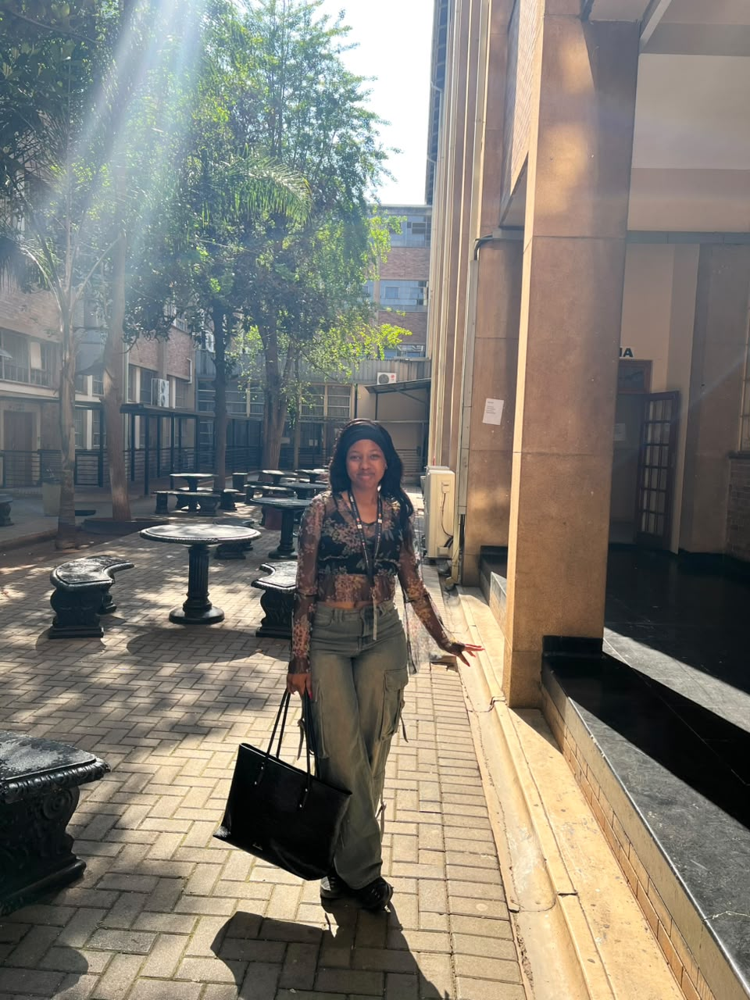

# 🚀 Engineering With Purpose

### 💻 Java Full Stack Developer · 🔐 Cybersecurity · ☁️ Cloud & AI

**I build useful things. I solve problems. I never stop learning.**

  
  

---

## 👋🏾 Hi, I'm Oratile

I'm a software developer. I love using technology to turn ideas into real solutions.

I started with the basics of programming and web development. Now I build full applications. That means front ends, back ends, APIs, databases, cloud deployment and AI features.

**My main interests:**

**Software Development × Cybersecurity × Cloud × AI**

 

---

## 🧠 What I'm Exploring

| Area | What I'm Learning |
|---|---|
| 💻 Software Engineering | Java, OOP & software design |
| 🌐 Full-Stack Development | React, JavaScript & REST APIs |
| 🔐 Cybersecurity | Security basics & safe coding |
| 🤖 Artificial Intelligence | AI apps, LLMs & RAG |
| ☁️ Cloud & DevOps | AWS, Docker & deployment |
| 🗄️ Data & Databases | SQL, MySQL, PostgreSQL & analytics |
| 🧪 Software Quality | Testing & clean code |
| 🤝 Teamwork | Agile, hackathons & group projects |

---

## 🧩 Tools I Use

**💻 Backend**
Java · Spring Boot · REST API

**🎨 Frontend**
HTML · CSS · JavaScript · React

**🗄️ Database & Data**
MySQL · PostgreSQL · Python · SQL · Data Analytics

**☁️ Cloud & Tools**
AWS · Git · GitHub · Docker

**🤖 AI**
AI · LLM · RAG

---

## 🎯 What I'm Working On

| | |
|---|---|
| 💻 **Software Development** | Building real apps |
| 🔐 **Cybersecurity** | Learning to code safely |
| ☁️ **Cloud & AWS** | Cloud tools and deployment |
| 🤖 **Artificial Intelligence** | AI-powered solutions |
| 🌐 **Full-Stack Development** | Frontend, backend and APIs |
| 🏆 **Hackathons & Teams** | Building and learning with others |

---

## 🛠️ Tech Stack

**Languages**

  

**Frameworks & Tools**

  

---

## ⭐ Featured Projects

### 💰 Mukuru Money Coach

An AI money coach that helps people track spending, reach savings goals and get simple money advice.

It works in **English, isiZulu and chiShona**.

**Built with:** `React` `Java` `Spring Boot` `PostgreSQL` `Docker`

🔗 **[View Project →](https://github.com/ORANKIIEY/Mukuru-Saver-Imali)**

---

### 🌐 Web Technology

A set of practical exercises on the basics of web development. I learned how websites are built, styled and put together.

**Built with:** `HTML` `CSS` `Web Development`

🔗 **[View Project →](https://github.com/ORANKIIEY/Introduction-to-webTech)**

---

### 🛒 Carts

A project about products, shopping carts, programming logic and user actions.

🔗 **[View Project →](https://github.com/ORANKIIEY/carts)**

---

### 📈 WordChart

A data visualisation project. It helped me get better at programming basics and working with charts.

🔗 **[View Project →](https://github.com/ORANKIIEY/wordchart)**

---

### 🔎 Want to see more?

👉 **[View all my repositories →](https://github.com/ORANKIIEY?tab=repositories)**

---

## 🌱 What I'm Learning Now

**Cybersecurity · Cloud Computing · Artificial Intelligence · Full-Stack Development**

I keep improving by building projects, trying new tools and learning from real challenges.

---

## 📊 My GitHub Activity

---

## 💡 How I Think

> **Don't just learn technology. Build with it.**

🌱 Not every project has to be perfect.

🧠 Every project should teach me something.

🚀 Every challenge is a chance to grow.

---

## 🤝 Let's Connect

💼 **LinkedIn:** [Oratile Masetla](https://www.linkedin.com/in/oratile-masetla-595816301)

💻 **GitHub:** [@ORANKIIEY](https://github.com/ORANKIIEY)

📧 **Email:** [oratiledineo75@gmail.com](mailto:oratiledineo75@gmail.com)

 

### 🌱 Thanks for stopping by!

**Keep building. Keep learning. Keep growing. 🚀**

